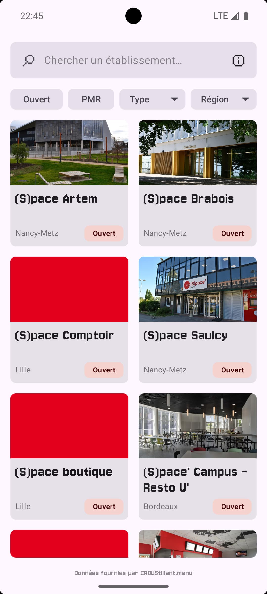
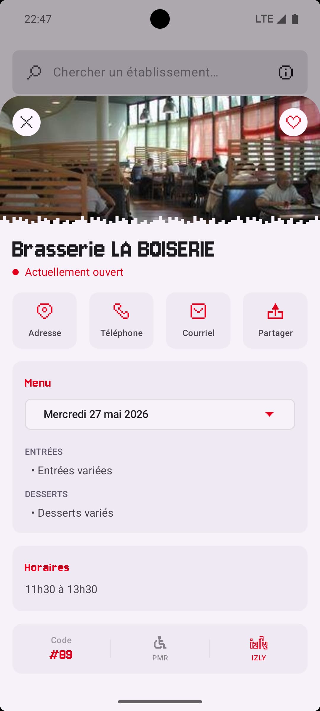
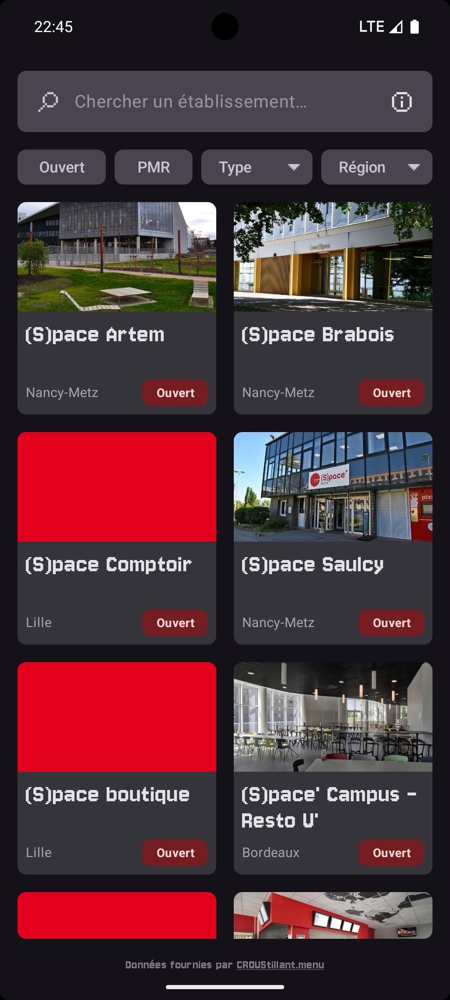
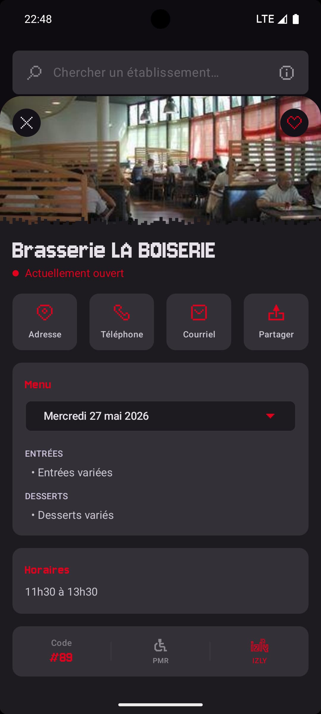

# 🔴 Croutsillapp

[Français](#-français) | [English](#-english) | [Español](#-español) | [Deutsch](#-deutsch)　　　　　[Code](#️-code)  |  [Credits](#️-credits)

---

  
  
  
  

---

## 🇫🇷 Français

**Croustillapp** est une interface pour l'API publique [CROUStillant](https://croustillant.menu). Cette application vous permet d'accéder au menu, à l'adresse et au contact de près de 1 000 restaurants CROUS référencés.

L'application est reconnue par l'équipe CROUStillant, mais est **INDÉPENDANTE** de ce projet **AINSI** que des services du CROUS.

### Pourquoi Croustillapp ?

* ✨ **Accessible** : Une barre de recherche, des filtres, les restaurants.

* ⚡ **Pratique** : Possibilité de filtrer les restaurants ouverts, ceux adaptés aux PMR, ainsi que par région et par catégorie.

* 🔒 **Confidentialité** : Aucune autorisation sensible, requiert seulement un accès à Internet.

* 🌍 **Multilingue** : Application disponible en français, anglais, espagnol et allemand.

* 🤝 **Transparence** : Code source 100 % ouvert, consultable par tous.

---

## 🇬🇧 English

**Croustillapp** is a frontend interface for the public [CROUStillant](https://croustillant.menu) API. This application allows you to access the menu, address, and contact information for nearly 1,000 listed CROUS student restaurants.

The application is recognized by the CROUStillant team, but remains **INDEPENDENT** of that project **AS WELL AS** the CROUS services.

### Why Croustillapp?

* ✨ **Accessible**: A search bar, filters, and the restaurants.

* ⚡ **Practical**: Easily filter restaurants that are currently open, PRM-accessible (wheelchair friendly), or by region and category.

* 🔒 **Privacy**: No sensitive permissions required, only needs Internet access.

* 🌍 **Multilingual**: App available in French, English, Spanish, and German.

* 🤝 **Transparency**: 100% open-source code, available for everyone to review.

---

## 🇪🇸 Español

**Croustillapp** es una interfaz para la API pública [CROUStillant](https://croustillant.menu). Esta aplicación le permite acceder al menú, la dirección y la información de contacto de casi 1.000 comedores universitarios CROUS registrados.

La aplicación está reconocida por el equipo de CROUStillant, pero es **INDEPENDIENTE** tanto de este proyecto **COMO** de los servicios del CROUS.

### ¿Por qué Croustillapp?

* ✨ **Accesible**: Una barra de búsqueda, filtros y los restaurantes.

* ⚡ **Práctica**: Posibilidad de filtrar los restaurantes abiertos, los adaptados para PMR (personas con movilidad reducida), así como por región y categoría.

* 🔒 **Privacidad**: Sin permisos sensibles, solo requiere acceso a Internet.

* 🌍 **Multilingüe**: Aplicación disponible en francés, inglés, español y alemán.

* 🤝 **Transparencia**: Código fuente 100% abierto y consultable por todos.

---

## 🇩🇪 Deutsch

**Croustillapp** ist eine Benutzeroberfläche für die öffentliche [CROUStillant](https://croustillant.menu)-API. Diese Anwendung ermöglicht Ihnen den Zugriff auf das Menü, die Adresse und die Kontaktdaten von fast 1.000 gelisteten CROUS-Mensen und -Cafeterien.

Die App wird vom CROUStillant-Team anerkannt, ist jedoch **UNABHÄNGIG** von diesem Projekt **SOWIE** von den Dienstleistungen des CROUS.

### Warum Croustillapp?

* ✨ **Barrierefrei & Einfach**: Eine Suchleiste, Filter und die Restaurants.

* ⚡ **Praktisch**: Möglichkeit, geöffnete oder barrierefreie (für Menschen mit eingeschränkter Mobilität geeignete) Restaurants nach Region und Kategorie zu filtern.

* 🔒 **Datenschutz**: Keine sensiblen Berechtigungen erforderlich, benötigt nur Internetzugang.

* 🌍 **Mehrsprachig**: App verfügbar auf Französisch, Englisch, Spanisch und Deutsch.

* 🤝 **Transparenz**: 100 % offener Quellcode, der für jeden einsehbar ist.

---

## 🛠️ Code

* **Langage / Language** : Kotlin

* **Android SDK** : Target API 36 (Android 16) / Min API 33 (Android 13)

* **Interface / UI** : Jetpack Compose

* **Base de données / Database** : Room

* **Asynchronisme / Asynchrony** : Kotlin Coroutines & Flow

* **Réseau / Network** : Retrofit & Kotlinx Serialization

* **Stockage des données / Data Storage** : Jetpack DataStore

* **Permissions** : `android.permission.INTERNET` & `android.permission.ACCESS_NETWORK_STATE`

---

## ℹ️ Credits

* **Développeur / Author** : Toum404

* **API** : [CROUStillant](https://github.com/CROUStillant-Developpement/CROUStillantAPI) par / by [Paul Bayfield](https://github.com/PaulBayfield)

* **Licence / License** : [Apache 2.0](LICENSE)