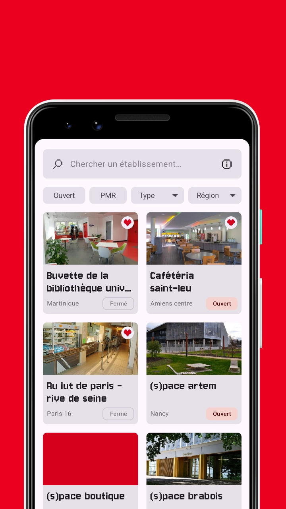

# 🔴 Croustillapp

<table>
  <tr>
    <td width="30%" align="center" valign="middle">
      
    </td>
    <td width="35%" align="center" valign="middle">
      
      <h3>Recherche rapide</h3>
      
Triez les restaurants selon leur statut, leur accessiblité, leur catégorie, ou leur région.

      
      <h3>Cache intelligent</h3>
      
Utilisable hors-ligne : les données seront actualisées dès que la connexion sera rétablie.

    </td>
    <td width="35%" align="center" valign="middle">
      
      <h3>Radar intégré</h3>
      
Prise en charge de la géolocalisation pour afficher les restaurants selon la distance.

      
      <h3>Widgets</h3>
      
Ajoutez vos restaurants favoris sur votre écran d'accueil : actualisation auto toutes les 8 heures.

    </td>
  </tr>
</table>

  <h3>Informations</h3>
  
<strong>Croustillapp</strong> est une application libre basée sur l'API publique <a href="https://croustillant.menu" target="_blank">CROUStillant</a>. Cette application vous permet d'accéder au menu, à l'adresse et au contact de près de 1 000 restaurants CROUS référencés.

  
Cette application n'est <strong>PAS</strong> l'application officielle du projet CROUStillant, et elle n'est <strong>AUCUNEMENT</strong> reconnue par le CROUS et ses services.

<table>
  <tr>
    <td width="40%">
      
      <h3>Sécurité</h3>
      
L'application ne récolte ni ne partage aucune données personnelles. Elle n'utilise que des bibliothèques libres et connues.

      
      <h3>Code libre</h3>
      
Le code source de l'application est entièrement disponible sur le GitHub dédié et est consultable par tous.

    </td>
    <td width="60%">
      

            <h3>Détails</h3>
            <h4>Langues</h4>
            
Français, English, Deutsch, Español

            <h4>Configuration</h4>
            
Pensé pour Android 16. Requiert Android 13 minimum.

            <h4>Crédits API</h4>
            
<a href="https://github.com/CROUStillant-Developpement/CROUStillantAPI" target="_blank">CROUStillant</a> par <a href="https://github.com/PaulBayfield" target="_blank">Paul Bayfield</a>.

            <h4>License</h4>
            
<a href="LICENSE">Apache 2.0</a>

        

    </td>
  </tr>
</table>